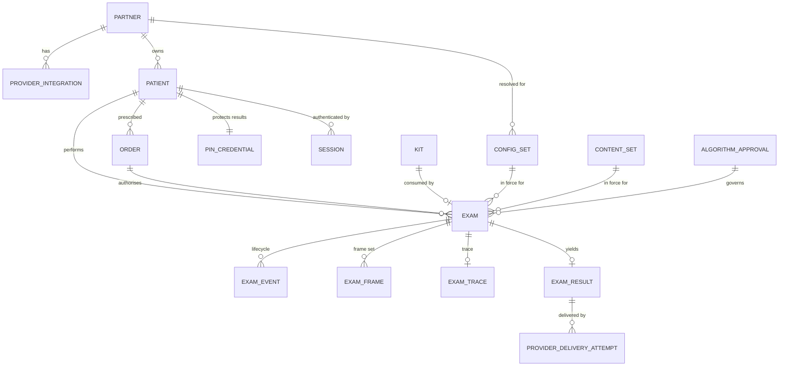

# Backend Data Model — Alternatives and Recommendation

Derived from `QACR-APP-EPIC-01 Rev 1.13` and, through it, `QACR-APP-FR-01 Rev 1.19`. It proposes
what the backend must hold, in three shapes, and recommends one.

**This document adds no requirements and restates none.** Every obligation below is named as *data*
and carries the requirement identifier that produces it. Where the wording matters, read the
requirement — `product/FR-01/QACR-APP-FR-01 Rev1.19.docx` governs. Nothing here is a decision
Product has taken; section 7 lists the questions this work surfaced, which belong in `decisions/`.

Existing behaviour cited as `file:line` comes from `evidence/behaviour.tsv` against the commits in
`evidence/pins.yaml`. Where this document says "the incumbent contract" it means the shape the ACR
and QACR applications are coded against today, which is evidence rather than a specification.

---

## 1 · What the requirements oblige the backend to hold

Neutral to all three alternatives. This is the inventory every shape has to satisfy.

### 1.1 Tenancy and provider

| Obligation | Driven by |
|---|---|
| A partnering organisation as a first-class scope, with logical isolation between organisations | `FR-SHR-001` |
| Each patient mapped to exactly one medical provider organisation | `FR-SHR-001` |
| Routing destination per organisation | `FR-SHR-002` |
| A separate integration setup and configuration per organisation, with an address allow-list | `FR-SHR-004`, `FR-SHR-005` |
| Per-partner designation as a demonstration partner, enforced server-side | `FR-CFG-004` |
| Per-partner post-result engagement mode | `FR-SHR-011` (priority undecided) |

`FR-SHR-001` is the control that stops a result reaching the wrong patient or the wrong provider.
Where isolation is enforced is therefore the single highest-consequence decision in this document,
and it is the axis the three alternatives differ most sharply on.

### 1.2 Identity, session and access

| Obligation | Driven by |
|---|---|
| Patient profile keyed on phone number, with date of birth | `FR-AUT-001`, `FR-AUT-003`, `FR-AUT-012` |
| More than one patient per phone number, distinguished by date of birth | `FR-AUT-011`, `FR-AUT-007`, `FR-AUT-015` (all M5) |
| Invite code with authenticity and expiry, consumed once | `FR-AUT-006` |
| One-time-password challenge: code, expiry, attempt count, lockout window, resend interval | `FR-AUT-004`, `FR-AUT-005`, `FR-AUT-018`, `FR-AUT-019` |
| Session token with expiry, revocable at sign-out, verified on every request | `FR-AUT-013`, `FR-AUT-014`, `FR-COM-010`, `FR-SEC-008` |
| PIN credential, whether one is registered, a failure counter and a limit, a setup deadline | `FR-ACC-002`, `FR-ACC-004`, `FR-ACC-005`, `FR-ACC-006` |
| Results-centre session invalidated on an inactivity interval | `FR-ACC-009` |
| Policy document identity, version and acknowledgement time | `FR-CNS-007` (M5) |

Note what may *not* be held: no credential, password or long-lived secret on the device
(`FR-SEC-008`), which makes the server the only place session state exists.

### 1.3 Eligibility to test

The start-up exchange answers with at most one reason why this user may not test (`FR-RDY-014`),
and a configured blocked state is one such answer (`FR-CFG-006`). That answer is computed from
data: app and OS version floors (`FR-RDY-004`, `FR-PLT-005`), hardware characteristics
(`FR-RDY-002`), the 24-hour window after a previous test (`FR-KIT-007`), and — in the incumbent
contract — an order.

The incumbent model is order-centric, not exam-centric. `getOrderStatus/{orderId}` returns
`algoStatus` and `partnerStatus` (`AndroidDip/.../Server.kt`), the bootstrap reconciles a current
order or clears it (`acr-ios`), and `orderId`, `partnerOrderId`, `orderStatus` and `orderExpiration`
are carried as first-class values. `FR-SHR-001` requires the model to support prescription
generation and return of results to the prescribing doctor, which is what an order is for. Whether
QACR keeps Order as an entity is an open question (§7).

### 1.4 Kit

| Obligation | Driven by |
|---|---|
| A register of kit identifiers against which validity and prior use are checked | `FR-KIT-002` |
| Conformance to a kit-identifier template | `FR-KIT-003` |
| Prior use detectable at scan time, and a result blocked when detected | `FR-KIT-004` |
| A valid use period per kit | `FR-KIT-005` (M5) |
| A practice scan that reads the register without consuming the identifier | `FR-IMG-022` |

`FR-IMG-022` is a data constraint disguised as a flow requirement: the kit checks must be runnable
read-only. A design where "check the kit" and "consume the kit" are the same write cannot satisfy
it.

The kit identifier is the QR content. Today that is a colour-board id with a `c:` prefix
(`AlgoRunner.kt:62`), validated through `validateColorBoardQr/{examId}`.

### 1.5 The exam record

The centre of the model, and the one entity a regulator will ask to see reconstructed.
`FR-ALG-004` names its contents directly: mobile and backend algorithm versions, application
version, backend version, a timestamp, device identifier, patient identifier, reported values, raw
results, error records and diagnostic metadata. Added to that:

| Obligation | Driven by |
|---|---|
| Smartphone model, OS version, application version | `FR-PLT-008` |
| The content-set version in force | `FR-TXT-004` |
| The configuration-set identity and version in force | `FR-CFG-003` |
| The frame set as defined by the IVTS specification, including per-frame torch state | `FR-CAM-001` |
| Per-image camera parameter set: torch, exposure, white balance, tone mapping | `FR-CAM-003` |
| An integrity check per transmitted payload | `FR-COM-004` |
| Rejection of incomplete, malformed or nonconforming payloads | `FR-COM-005` |
| A retrievable result, requested by the application against a specific exam | `FR-COM-011`, `FR-RES-001` |
| Retransmission of data whose earlier transmission did not complete | `FR-RDY-012`, `FR-COM-006` |
| Invalidation on termination, on cancellation, and on timing grounds | `FR-STA-007`, `FR-STA-010`, `FR-TIM-009`, `FR-TIM-011` |
| Demonstration state for the exam | `FR-RES-006`, `FR-CFG-004` |

Two things follow that the requirements do not say in one place.

**Retransmission needs an idempotency key, and the incumbent one will not do.** `FR-RDY-012` and
`FR-COM-006` both retry, so the same exam can arrive twice. On qacr-ios the exam identifier is a
second-resolution Unix timestamp — `ExamData.swift:22` sets
`self.examID = String(Int(Date().timeIntervalSince1970))` — which is neither globally unique nor
collision-free across devices. `ExamBuilder.swift:166-168` compounds it: a cancelled capture stores
the exam id so the next builder re-adopts the abandoned frames. Any alternative below needs a
server-assigned identifier plus a client-supplied idempotency key that is stable across retries;
`ExamData.RequestPayload` already carries `clientCreatedAt`, `examId` and `colorBoardId`
(`ExamData.swift:44-63`), which is enough material to form one.

**The upload is a lifecycle, not a write.** On qacr-ios the sequence is
`notStarted → sendExam → uploadTrace → validateColorboardQR → getResults → userStepsEnded →
uploadFrames → runEnded` (`Progress.swift:25-34`), persisted with the exam — acr-ios interposes
`getNextFlow` in its own ordering (`ExamSenderHandler`). The Android side declares `Exam.State` as `INITIAL, CREATED, ALGO_UPLOADED,
COLOR_BOARD_VALIDATED, HAS_RESULTS, ORDER_STATUS_RECEIVED` (`State.kt:451-453`). Whatever shape is
chosen has to hold a partially-assembled exam for as long as a home user's connection takes, and
survive the application being closed mid-sequence.

### 1.6 Result and delivery

| Obligation | Driven by |
|---|---|
| Albumin, creatinine and the ratio, with units | `FR-ALG-001`, `FR-RES-002`, `FR-RES-003`, `FR-RES-007` (M5) |
| An unambiguous valid-versus-invalid distinction, such that no numeric value is reachable for an invalid test | `FR-ALG-010`, `FR-RES-005` |
| An invalid reason category from a defined enumeration | `FR-ALG-012` |
| An out-of-measuring-range condition, distinct from a value | `FR-ALG-011`, `FR-RES-004` |
| Quality-control outcomes that block reporting | `FR-ALG-005`–`FR-ALG-009` |
| A controlled mapping between supported configurations and approved algorithm versions | `FR-ALG-002` |
| Validation that the mobile and backend algorithm versions form an approved combination | `FR-ALG-003` (priority undecided) |
| Per-attempt provider transmission record: handshake, acknowledgement, failure, retry | `FR-SHR-006`, `FR-SHR-007`, `FR-SHR-008` |
| Most recent result plus the date the test was performed | `FR-PRT-001` |
| The last five results | `FR-PRT-015` (M5) |
| A results letter as a PDF | `FR-SHR-015`, `FR-PRT-009` (M5) |

The `FR-ALG-012` enumeration is a schema decision with a user-visible consequence: it sets how many
distinct outcomes the application can present. Evidence shows the incumbent enumerations already
disagree with each other — acr-android recognises three server strings and maps everything else to
`RESULTS_FAILED`, acr-ios declares six troubleshooting cases, qacr-android declares seventeen, and
qacr-ios carries an `ExamErrorCode` inherited from ACR's dipstick vocabulary. Whichever alternative
is chosen, this enumeration should be defined once, server-side, and versioned.

### 1.7 Configuration, content and approved versions

| Obligation | Driven by |
|---|---|
| A configuration set retrieved before a test, comprising every server-supplied value, resolved for the application and for the partner | `FR-CFG-001` |
| Schema validation of that set, with no fallback to a build-embedded set | `FR-CFG-002` |
| The set's identity and version recorded on the exam | `FR-CFG-003` |
| A blocked state expressible in configuration | `FR-CFG-006` |
| A backend-configurable list of supported OS versions and minimum hardware characteristics | `FR-PLT-005` |
| A versioned content set covering written text and recorded audio together, per step | `FR-TXT-004`, `FR-FLW-003` |
| A parameter set resolved outside the build that includes or omits flow steps | `FR-FLW-006` |
| Every system parameter under configuration control with a value, range and rationale | `FR-LCM-006`, `FR-LCM-018` |

`FR-CFG-003` is the requirement that makes configuration part of the record rather than part of the
runtime: a completed exam must be reconstructible with the configuration it ran under. That means
configuration sets are immutable once published and referenced by the exam, not mutable rows read
at result time. Evidence suggests the incumbent does not work this way — the iOS init response is
hand-parsed field by field with no top-level `Decodable` and no schema
(`AppConfiguration.updateInitValues(data:)`, 44 assignments dominated by `self.x = data.x ?? self.x`),
which is also what `FR-CFG-002` addresses.

### 1.8 Audit and analytics

Security-relevant events go to the backend for audit logging — authentication attempts and their
outcome, PIN entry failures, device-integrity failures, and any condition that blocked a test
(`FR-SEC-013`). They carry no personal or health information, and `FR-ANL-002` applies to this
channel as well as the analytics one. Analytics events themselves go to Mixpanel, not the backend,
under a pseudonymous identifier the analytics service cannot resolve to a patient (`FR-ANL-003`) —
which means if any mapping from pseudonym to patient exists, the backend is where it lives, and it
is a disclosure risk in its own right.
**Resolved 2026-08-23 (AQ-08, `AD-8` amended, decision log L11.11): no such mapping exists.** The
pseudonym is generated on the device and never reaches this backend, and it is never derived from a
patient identifier. `FR-ANL-004`'s M5 proxy is the one place a QACR component would see the session
and the pseudonym together; it is bound as a pass-through that records neither the event body nor any
correlation between them.

### 1.9 What the requirements do not say

Device-side retention is bounded (`FR-SEC-001`, `FR-SEC-006`, `FR-COM-007`: delete on
acknowledgement). **No requirement bounds backend retention of frames, traces or exam records.**
That is a gap, not a licence — see §7.

---

## 2 · The forces that decide between shapes

1. **Reconstruction.** `FR-ALG-004` and `FR-CFG-003` together require that a past exam can be
   reproduced: its inputs, the versions in force, the values reported. `FR-LCM-009` and
   `FR-LCM-010` extend that to release verification. A model where any of it can be updated in
   place has lost the record.
2. **Isolation as a single enforcement point.** `FR-SHR-001` is a safety control. A control enforced
   in two mechanisms is two controls to verify and two to get wrong.
3. **Synchronous, strongly-consistent checks.** Kit reuse is detected at the point of scanning
   (`FR-KIT-004`) and the eligibility answer is given in the start-up exchange (`FR-RDY-014`). Both
   are read-then-decide with a user waiting. Neither tolerates a stale read.
4. **Milestone staging.** M1 is a demonstration with no authentication, no consent, no kit
   validation and no results centre. The model has to be useful at M1 and
   still be the same model at M3, which favours additive growth over restructuring.
   **Corrected 2026-08-23 (AQ-10, decision log L11.2): "and no security controls" is withdrawn.**
   `FR-SEC-014` forbids a build without the `FR-COM-001`/`FR-COM-002` transport controls from
   holding data that came from a patient, and M1 is that build. AD-21 therefore binds M1 to
   synthetic data only (AD-18) and requires its credential to carry its own expiry — at most 90
   days — with CI rejecting the M1 credential path once the AD-6 authentication path is enabled.
   M1 has no *authentication*; it is not without controls.
5. **Payload variability.** Diagnostic metadata, QC outputs and camera parameter sets will change
   with every algorithm and IVTS revision. Whether normalisation happens on the device or in the
   backend is itself undecided (`FR-IMG-016`, register item Q-24), and that decision changes what
   has to be stored. **Still undecided as of 2026-08-23, now tracked as `OQ-15` (AQ-05, decision log
   L11.10);** `AD-27` bounds the variability by requiring the artefacts crossing the algorithm port to
   be enumerated and versioned, so a change to the set is a contract version change rather than a
   field appearing.
6. **Verification cost.** Every mechanism in the data layer is something `FR-LCM-017` has to test
   before each release. Cleverness is charged for annually.

---

## 3 · Alternative A — Exam-centric relational core with immutable version bindings

A single PostgreSQL schema. Mutable lifecycle state lives on the exam row; everything that
constitutes the record is either an immutable row the exam points at, or an append-only child
table. Frames and traces live in object storage; the database holds their keys and checksums.
**Clarified 2026-08-23 (AQ-03, decision log L11.4g): the stored checksum is the client-supplied
digest the server recomputed and accepted, never one the server computed after arrival.** A
server-computed checksum proves nothing about transit and satisfies `FR-COM-004` on paper only. See
`spine.md` AD-23.
Partner isolation is a mandatory `partner_id` column on every tenant-scoped table, enforced by
row-level security bound to the session's partner, so no application query can escape it.

**Tables.** `partner`, `provider_integration`, `patient`, `invite_code`, `auth_challenge`,
`session`, `pin_credential`, `results_centre_session`, `consent_ack`, `kit`, `config_set`,
`content_set`, `algorithm_version`, `algorithm_approval`, `system_parameter`, `exam`, `exam_event`,
`exam_frame`, `exam_trace`, `exam_result`, `provider_delivery_attempt`, `results_letter`,
`device_install`, `audit_event`.

`order` is not a table yet: §7.3 is answered — Order is out of scope this phase and its shape is not
designed. The ERD above carries `ORDER` only to mark the future direction of reference — when it
arrives, it holds references outward to the exam and kit rather than being referenced by them, so it
is not in the table list above or the milestone staging below.

**The exam row** carries `id` (server-assigned UUID), `idempotency_key` (unique, from
`clientCreatedAt` + `colorBoardId` + install reference), `client_exam_ref` (the device's own value,
kept for support and log correlation but never a key), `partner_id`, `patient_id`,
`kit_id`, `state`, `is_demonstration`, `device_snapshot` (JSONB: model, OS version, app version —
`FR-PLT-008`), and foreign keys to `config_set`, `content_set` and `algorithm_approval`. Those four
target tables are insert-only, so `FR-CFG-003` and `FR-ALG-004` hold by construction rather than by
policy.

**Where the record's immutability comes from.** `exam_result` is one row per exam, insert-only, with
`validity`, `acr_value`, `acr_category`, `albumin_value`, `creatinine_value`, `units`,
`out_of_range`, `invalid_reason_code`, and two JSONB columns — `qc_outcome` and `diagnostics` — each
stamped with a schema version. `exam_event` is an append-only log of the lifecycle
(`created`, `trace_uploaded`, `kit_validated`, `frames_uploaded`, `analysis_started`,
`qc_failed`, `result_issued`, `invalidated`, `delivered`), keyed `(exam_id, seq)`.
**Added 2026-08-23 (AQ-03, decision log L11.4e-f).** `exam_result` being one row per exam is what
makes a replayed algorithm callback harmless *and* what makes a forged one dangerous: first-writer
wins, so a callback arriving before the genuine one becomes the clinical result. AD-23 therefore
requires the callback to present a single-use credential minted at job dispatch and bound to that
exam and algorithm run. **No table here holds that credential's acceptance state**, and there is no
`algorithm_run` entity for it to hang from — a build-time gap this document should close when the
algorithm callback is specified, not an open architectural question.

`provider_delivery_attempt` is append-only, which is what makes `FR-SHR-007` retry a query rather
than a state machine. `audit_event` is append-only, writable by a role that cannot read the patient
tables.

**Kit consumption.** `kit` holds a unique `kit_identifier` and a nullable `consumed_by_exam_id`. The
practice-scan requirement (`FR-IMG-022`) is satisfied because validation is a `SELECT` and
consumption is a separate `UPDATE … WHERE consumed_by_exam_id IS NULL`; reuse detection
(`FR-KIT-004`) is that update returning zero rows.

**Strengths.** Every hard, synchronous question in §2.3 is a single indexed read. `FR-SHR-001` has
exactly one enforcement point. Approved-combination checking (`FR-ALG-003`) is a join, not
application logic. The M1 subset is a genuine subset — four tables — and grows additively.
Verification is against mechanisms the team already knows how to test.

**Weaknesses.** Immutability of `config_set`, `content_set` and `exam_result` is enforced by grants
and triggers, not by the storage engine; a migration can still violate it, so that becomes a review
item. Diagnostic payloads in JSONB are unvalidated by the database, which shifts the burden to
schema validation at the write boundary. And the ORM habit of `UPDATE` has to be actively resisted
on the insert-only tables.

---

## 4 · Alternative B — Event-sourced exam ledger with relational projections

The exam has no mutable row. It is a stream of immutable events —
`(exam_id, seq, type, occurred_at, recorded_at, actor, payload)` — and everything read is a
projection built from that stream: `exam_current` for the upload lifecycle, a results-centre view
for `FR-PRT-001` and `FR-PRT-015`, a delivery queue for `FR-SHR-007`. Identity, tenancy and the kit
register stay relational, because uniqueness and "has this been used" cannot be expressed as a
stream.

**Strengths.** The regulatory story is the strongest of the three: reconstruction is not a property
the design maintains, it is what the store *is*, and `FR-ALG-004` falls out for free. The incumbent
multi-call upload sequence maps onto events almost one-to-one, so the impedance between the wire
protocol and the store is near zero. Retransmission is naturally idempotent — a duplicate event key
is a no-op, which is exactly what `FR-RDY-012` and `FR-COM-006` want. Invalidation
(`FR-STA-007`, `FR-STA-010`, `FR-TIM-009`, `FR-TIM-011`) is an appended fact rather than a
destructive edit, so *why* a test was invalidated survives.

**Weaknesses, and why they are decisive here.** The two checks that cannot be stale — kit reuse at
scan, and the eligibility answer — must read something strongly consistent, so the model is already
half relational and the ledger is not carrying the load where it is hardest. Every projection is
software that `FR-LCM-017` must verify before each release, and a projection bug is a wrong result
shown to a patient, not a stale dashboard. Append-only storage fights data subject erasure and any
future backend retention bound (§1.9), and the answer — crypto-shredding, or events that reference
rather than embed personal data — is more machinery. Finally, the model is least legible at M1,
where the team most needs to move quickly, and the demonstration build has no audit obligation to
justify the cost.

---

## 5 · Alternative C — Document exam record, relational identity core

Polyglot. The exam is one self-describing document (Mongo, DynamoDB or Firestore) embedding its
device snapshot, config-set and content-set versions, algorithm versions, frame descriptors with
their camera parameter sets, QC diagnostics and the result. Identity, tenancy, order, kit register,
session, PIN and audit stay in a relational store.

**Strengths.** It matches the wording of `FR-PLT-008`, `FR-CFG-003` and `FR-ALG-004` most literally —
each speaks of "the test record" as a thing. A single-document write is atomic and idempotent
without extra mechanism. The variability in §2.5 is absorbed without migration: a new IVTS revision
adding fields to the camera parameter set changes nothing structural, which matters while
`FR-IMG-016` is undecided. Nested frame metadata is a natural fit for a nested representation.

**Weaknesses, and why they are decisive here.** `FR-SHR-001` is now enforced by two mechanisms in
two stores — and it is the control that stops a result reaching the wrong patient. That is the wrong
place to accept duplication. There is no transaction spanning the exam document and the kit
register, so consuming a kit and recording the exam that consumed it can diverge, and the
divergence is exactly the condition `FR-KIT-004` exists to catch. The approved-combination check
(`FR-ALG-003`), the delivery retry queue (`FR-SHR-007`) and the last-five-results query
(`FR-PRT-015`) all become application-side joins across stores. And the regulatory record now spans
two systems with two backup and restore stories, which `FR-LCM-010` has to verify as one.

> **Answered 2026-08-23 — `spine.md` AD-26, `spine-decision-log.md` L11.9.** Adopting Alternative A
> reduced this objection but did not remove it: frames and traces still live outside the database. The
> two stories are made verifiable as one not by synchronising the stores — no consistent point-in-time
> across Cloud SQL and GCS exists — but by making one of the two restore orderings impossible. A row
> referencing an object is written only after the object is durable, an object is never deleted while a
> live row references it, and there is no bucket-wide rollback. The RPO and RTO figures are `OQ-14`.

---

## 6 · Recommendation

**Adopt Alternative A**, with two named grafts from the others:

1. **The `exam_event` append-only log from B**, kept alongside the mutable exam row rather than
   instead of it. It buys the reconstruction and idempotency story — a duplicate event key is a
   no-op, an invalidation is an appended fact — without making any read depend on a projection.
2. **A single versioned JSONB `diagnostics` document per exam from C**, validated at the write
   boundary against a published schema. It absorbs the payload variability of §2.5, and confines it
   to one column rather than letting it shape the whole store.

This is not hedging. Both grafts are additive — one table and two columns — and neither changes the
consistency model. B and C each ask for a different consistency model as the price of their
strength, and in both cases the price is charged against `FR-SHR-001`, `FR-KIT-004` or
`FR-LCM-017`, which are the three places this product can least afford it.

**Why A over B.** B's advantage is reconstruction, and A gets most of it from insert-only version
tables plus the grafted event log. B's cost is that every read is verified software, and the reads
in question decide what a patient is told about their kidneys.

**Why A over C.** C's advantage is schema flexibility, and A gets it from one JSONB column. C's cost
is two enforcement points for the one control that must not fail.

### 6.1 What must be true for the recommendation to hold

- `config_set`, `content_set`, `algorithm_version`, `algorithm_approval`, `exam_result`,
  `exam_event`, `provider_delivery_attempt` and `audit_event` are insert-only, enforced by grants
  and triggers, and that enforcement is itself a release-verification item under `FR-LCM-010`.
- Row-level security on `partner_id` is the only isolation mechanism. No application-level partner
  filter is written, because a second mechanism invites the two to disagree.
- The exam's primary key is server-assigned. The device's `examId` is stored as
  `client_exam_ref` for correlation and is never a key — see `ExamData.swift:22`.
- The `FR-ALG-012` reason enumeration is defined once, server-side, and versioned. The four
  divergent client enumerations in `evidence/behaviour.tsv` are the argument.
- `FR-CFG-002` schema validation runs at publish time, not read time, so an invalid set never
  becomes referenceable.

### 6.2 Milestone staging

Additive throughout; no restructuring between milestones.

| Milestone | Tables added | Notes |
|---|---|---|
| M1 — demo | `partner`, `config_set`, `exam`, `exam_event`, `exam_frame`, `exam_trace` | Result comes from a fixed demonstration payload (`FR-RES-006`), and the demonstration designation is server-side (`FR-CFG-004`). No patient, no session, no kit register. Per AD-20 the designation is a property of the `partner`, `exam.is_demonstration` is stamped from it at creation and never read from the request, and a demonstration exam writes **no outbox row** — so nothing it produces can leave the system. |
| M2 — usability | `algorithm_version`, `algorithm_approval`, `exam_result` | `FR-ALG-004` version recording, and the validity plus reason-category contract (`FR-ALG-010`, `FR-ALG-012`). |
| M3 — submission | `patient`, `auth_challenge`, `session`, `kit`, `content_set`, `provider_integration`, `provider_delivery_attempt`, `system_parameter` | Tenancy RLS switched on. `FR-CFG-003` and `FR-TXT-004` bindings become mandatory on the exam. `order` is not staged here — its shape is undecided per §7.3. |
| M4 — high priority | `pin_credential`, `results_centre_session`, `invite_code`, `audit_event` | `FR-SEC-013` audit channel, with a role that cannot read patient tables. |
| M5 — future | `consent_ack`, `results_letter`, `device_install` | Plus relaxing `patient` to N-per-phone-number (`FR-AUT-011`), which is why the phone number should not be `patient`'s primary key at M3. Under AD-23 the phone number is not a query key on any read path either, so the relaxation is additive and no read changes with it. `consent_ack` stays M5 (§7.5) and gates nothing before then; when it is built it must be insert-only under AD-4 — an acknowledgement is a fact with a time, never a row to update. |

---

## 7 · Questions this raised that only Product or the backend owner can close

Per the repository rules these belong in `decisions/`, one file each, not as assumptions here.

**Three of these were answered on 2026-08-19** — see `spine-decision-log.md` L12.6, which holds the
user's answers verbatim. They are 1, 3 and 9 below, annotated in place. The other six remain open.

1. **Backend retention.** Nothing bounds how long the backend keeps frames, traces or exam records.
   `FR-SEC-001` and `FR-SEC-006` bound the device only. This changes the storage design materially
   and interacts with any erasure obligation.
   **Answered (2026-08-19): match ACR, and follow the applicable regulation.** This does not settle
   the storage design yet, because ACR's actual retention has not been read — no retention period,
   GCS lifecycle rule or purge job was found anywhere in this investigation. Establish what ACR does
   (behealthy bucket lifecycle configuration; any purge/archival cron) before sizing frame and trace
   storage.
2. **Where normalisation happens** — device or backend (`FR-IMG-016`, register item Q-24). If
   backend, raw or raw-equivalent frames must be retained and the frame table grows accordingly.
   **Carried forward 2026-08-23 (AQ-05, decision log L11.10): the placement is now `OQ-15`**, owner
   algorithm owner + backend owner, unblocked by an IVTS specification revision stating the
   representation and where the transform runs. `AD-27` fixes what does not depend on it: exactly one
   component normalises, the algorithm port names which, and whatever the algorithm consumed is
   retained together with the version of the transform that produced it. **One correction to the
   sentence above:** "must be retained" overstates it. `FR-ALG-004`'s "raw results" is algorithm
   output, not raw frames, and §1.9 is right that no requirement bounds backend frame retention at
   all. Raw-frame retention is a *consequence* of `AD-27`'s record rule once backend normalisation is
   chosen — a decision to take, not an obligation already in hand.
3. **Does Order survive into QACR?** The incumbent contract is order-centric and `FR-SHR-001` needs
   prescription generation, but no QACR requirement names an order. If it survives, its status and
   expiry are part of the eligibility answer of `FR-RDY-014`.
   **Answered (2026-08-19): out of scope this phase, arriving later, and to be as decoupled as
   possible from the kit and the exam.** Consequences for this model: no `order_id` column on `exam`
   or `kit` — when Order arrives it is its own table referencing them outward, so no commercial field
   sits in the clinical record and an exam is valid with no order in existence. Order status and
   expiry are therefore *not* part of the `FR-RDY-014` eligibility answer at this phase.
4. **What the results centre contains** (register item Q-23, and the `FR-PRT-001` note): whether
   invalidated tests appear, and whether results belonging to another registered user on the same
   phone number are excluded. The second bears on RA 6.4 and decides whether the results query is
   scoped by patient or by phone number.
   **Split and dispositioned (2026-08-23, AQ-06, decision log L11.12).** The scoping half was never
   Product's — `FR-COM-010` (M3) already requires the backend to reject a request "attempting to act
   on a patient record other than the one associated with the verified user", and that clause is
   QACR's, not user-management's. Landed in `spine.md` **AD-23**: the resolved patient identifier is
   the only accepted scope for a patient-facing read, and **the phone number is never a scope, a
   query key or a lookup path**. So the query is scoped by patient, and it stays that way when
   `FR-AUT-011` lands at M5. What remains Product's is what the screen *contains* — whether
   invalidated tests appear, and whether a household is intended to see one another's results — and
   that is now `decisions/D-01.md`.
5. **Consent recording timing** (register item Q-11). `FR-CNS-007` is M5; the backend SRS wants
   consent recorded before a test starts. If the SRS position holds, `consent_ack` moves to M3 and
   becomes a precondition of exam creation.
   **Closed (2026-08-23, AQ-07, decision log L11.13) — there was no live conflict, and this entry
   overstated it.** `FR-CNS-007`'s own note resolves it and names the direction: the SRS "makes
   consent recording mandatory before a test starts as SRS-BE CON.1, **so that document is to be
   relaxed to match**". `FR-CNS-007` stays M5. Independently, `consent_ack` could not have moved to
   M3 anyway: the acknowledgement gate it records (`FR-CNS-002`, `FR-CNS-003`) is **M4** by recorded
   product decision, because users do not go through phone verification at M3. So the M5 row below
   stands, and **exam creation acquires no consent precondition at M3 or M4** — a Deferred row in
   `spine.md` now says so, since a developer reading the SRS would otherwise add one to the AD-5
   transaction. Two items carried there rather than closed: `FR-CNS-007` is silent on whether a
   recorded acknowledgement is a *precondition* at M5, and SRS-BE CON.1 is still unrelaxed on paper,
   which is a QMS traceability defect.
6. **Kit valid-use period** (register item Q-12). `FR-KIT-005` is M5 and RA 7.25 was removed. If it
   is withdrawn rather than deferred, `kit.valid_until` should not be built.
7. **`appUniqueIdentifier` and the phone-to-patient cardinality** (register item Q-10). Confirming
   the current configuration is not the same as confirming the schema may assume one patient per
   phone number.
8. **Is a pseudonym-to-patient mapping held at all?** `FR-ANL-003` requires the analytics service
   cannot resolve it. If the backend holds the mapping so that support can, that is a disclosure
   surface worth stating deliberately rather than discovering.
   **Answered 2026-08-23 (AQ-08, decision log L11.11): no mapping.** `FR-ANL-001` has the *software*
   transmit events, so the backend is not on the analytics path before `FR-ANL-004`'s M5 proxy; the
   pseudonym is generated on the device and never issued, received or stored here. A **derivation
   from the patient identifier is ruled out explicitly** — it is a mapping whether or not a table
   exists. If support ever needs the resolution it is a deliberate act on `AD-8`'s existing terms: a
   named register row with a stated retention and `FR-SEC-013` audited reads under `AD-17`. Two
   additions: the M5 proxy is a pass-through logging no event body and no session-to-pseudonym
   correlation, and the analytics pseudonym is never the same value as the study kit identifier the
   research feed reconciles on.
9. **`FR-ALG-003` and `FR-SHR-011` priorities are undecided.** The first decides whether
   `algorithm_approval` is enforced or merely recorded; the second decides whether an entire
   post-result branch exists per partner.
   **Answered (2026-08-19): both deferred.** Interim treatment, chosen so that deferring stays
   genuinely reversible: `algorithm_approval` rows are **written and referenced from every exam but
   enforced nowhere** — no write path is blocked on them, so enabling enforcement later is a check
   against data that already exists. For `FR-SHR-011`, the per-partner config surface stays (it is
   needed for `FR-CFG-004` regardless) and **no post-result branch is built**.
