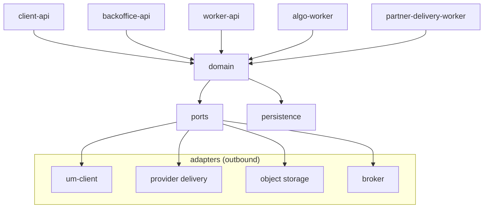
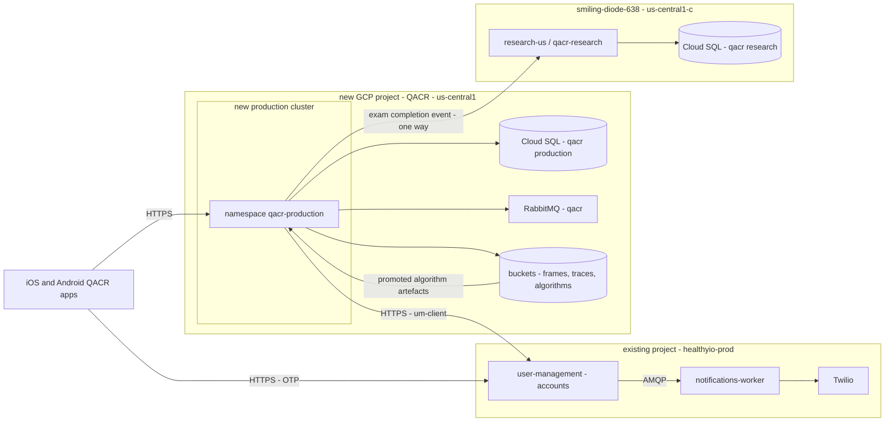
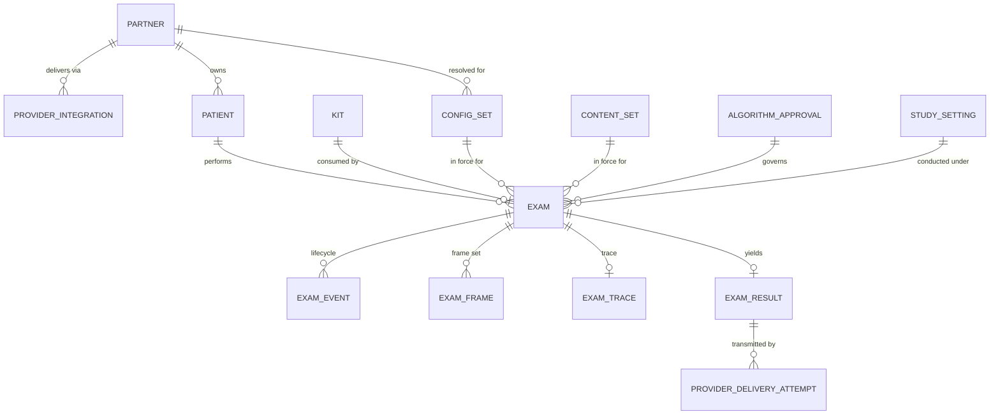

# Architecture Spine — QACR backend

Requirements are referenced by id. `product/` governs the wording; nothing here restates it.
Rationale lives in `architecture/spine-decision-log.md`, keyed by the `L`-numbers cited. Evidence
about the existing estate lives there too, as `E`-numbered rows with their path citations — the two
investigation documents that used to hold it were absorbed into that log (L12) and deleted.

## Design Paradigm

**Modular monolith, ports-and-adapters at the edges.** One repository, one application image plus a
separate algorithm image, many runtime roles. A role is a Helm alias over the same image, not a
service with its own repository. Everything crossing the process boundary — provider delivery,
user-management, the algorithm runtime, object storage, the broker — is an adapter behind a port.

This ratifies what `backend.q-acr` already is (npm workspaces; two images; twelve workloads by Helm
alias) rather than introducing a pattern. Layer-to-directory mapping is in Structural Seed.

## Inherited Invariants

`be-infra` user-management binds this scope and is read-only here. A local decision that contradicts
one of these is a conflict to surface, not an override.

| Inherited | From | Binds here | Evidence |
| --- | --- | --- | --- |
| Patient identity, OTP challenge, session token, PIN credential and their limits | user-management | `qacr-backend` implements none of them. See AD-6 | [OBSERVED] `be-infra/projects/user-management/handlers/phone-verification/`, `lib/models/core/` |
| `Users.fullName` and `Users.email` are `allowNull: false`, and `email` is unique | user-management | QACR collects neither (`FR-AUT-*` uses phone + date of birth + invite code). Registration must supply a documented placeholder for both | [OBSERVED] `lib/models/core/user.js` |
| `Users.phone` is nullable and not unique | user-management | `FR-AUT-011` many-users-per-phone is already supported by the schema; no change needed at M5 | [OBSERVED] `lib/models/core/user.js` |
| `phone_verification` is one of thirteen auth provider types; Auth0 and the EHR providers serve other applications | user-management | QACR's path is `phone_verification` only. Auth0 is not on any QACR path | [OBSERVED] `projects/user-management/enums.js` |
| OTP SMS is published by user-management over AMQP to notifications-worker, inside the existing GCP project | user-management | `qacr-backend` has no Twilio relationship and no notification capability before M5. See AD-7 | [OBSERVED] `handlers/phone-verification/helpers.js` |
| user-management is reached over public HTTPS at `accounts-{staging,production}.healthy.io`, and both QACR apps already carry the host | user-management | Consumption is unaffected by QACR running in a different cluster and GCP project | [OBSERVED] `spine-decision-log.md` E-5 |

ACR (`behealthy`, `urine.com.services.backend`) is a **source, not a parent**. Its patterns are
inputs that may be rejected; its decisions do not bind. Per `SDLC.md`, ACR behaviour is evidence and
never a QACR decision.

## Boundary With backend.q-acr (research)

| Surface | Owner | Contract | Change protocol |
| --- | --- | --- | --- |
| Exam completion event, production → research | Production publishes | Versioned payload carrying `schema_version`, emitted through the outbox (AD-9). Consumer in `backend.q-acr` writes the research row and sets `Exam.prodId` | Additive fields only; a breaking change is a new `schema_version` with both accepted during migration |
| Algorithm artefacts, research → production | Research produces | Tarball in the production algorithms bucket plus an `algorithm_version` row. Promoted artefact, never a live dependency | Promotion is an explicit act with a recorded approval |
| Everything else | — | Nothing. Research never calls production; no shared credential, database or control queue | — |

## Invariants & Rules

### Dependency direction

Arrows are the only permitted direction. The domain depends on ports, never on an adapter. No
runtime role depends on another runtime role in-process. Enforced mechanically — see AD-1.

### AD-1 — One repository, one image, roles as Helm aliases

- **Binds:** all
- **Prevents:** the backend fragmenting into networked services, which would put a network boundary
  inside the kit-consume-plus-exam-write transaction of `FR-KIT-004` and multiply what `FR-LCM-017`
  must verify before each release
- **Rule:** one repository (`qacr-backend`), one application image plus the algorithm image. A new
  runtime role is a Helm alias over an existing image. Workspace import boundaries are enforced in CI
  by a dependency rule, not by convention; a violating import fails the build

### AD-2 — One database; row-level security on `partner_id` is the only isolation mechanism

- **Binds:** all tenant-scoped data
- **Prevents:** `FR-SHR-001` being enforced twice and the two enforcements disagreeing — the failure
  whose consequence is a result reaching the wrong patient or provider
- **Rule:** one PostgreSQL database per deployment of this backend, and today there is exactly one.
  Every tenant-scoped table carries `partner_id` under an RLS policy. No application-level partner filter is written anywhere. Partner
  context is set with `SET LOCAL` inside each transaction, never as a session variable. The
  application role owns no tables and does not hold `BYPASSRLS`. Cross-partner read attempts are
  asserted to return zero rows by tests in CI, and that enforcement is a release-verification item
  under `FR-LCM-010`

### AD-3 — Exam identity is server-assigned; the device's identifier is correlation only

- **Binds:** exam creation, all upload and retransmission paths
- **Prevents:** idempotency resting on the device's second-resolution timestamp, which is neither
  unique nor collision-free across devices, while `FR-RDY-012` and `FR-COM-006` both retry
- **Rule:** the exam primary key is a server-assigned UUID. A unique `idempotency_key` derived from
  the client-supplied creation time, board identifier and install reference makes retries no-ops.
  `client_exam_ref` is stored for correlation and support, and is never a key or a lookup path. The
  key is **deduplication, not replay protection** — it is derived from client-supplied values, so a
  captured request replays to the same key by design. Replay is AD-23's concern

### AD-4 — The record is insert-only

- **Binds:** `config_set`, `content_set`, `algorithm_version`, `algorithm_approval`, `exam_result`,
  `exam_event`, `provider_delivery_attempt`, `audit_event`
- **Prevents:** reconstruction of a past exam being lost to an in-place update, which `FR-ALG-004`
  and `FR-CFG-003` together forbid
- **Rule:** these tables are insert-only, enforced by grants and triggers rather than by ORM
  discipline. A correction is a new row, never an edit. Invalidation is an appended fact. The
  enforcement itself is a release-verification item under `FR-LCM-010`

### AD-5 — Checking a kit and consuming a kit are separate operations

- **Binds:** kit register, exam creation, practice scan
- **Prevents:** `FR-IMG-022`'s practice scan consuming the identifier, and reuse detection becoming
  ambiguous
- **Rule:** validation is a read. Consumption is `UPDATE … WHERE consumed_by_exam_id IS NULL` in the
  same transaction as the exam write. `FR-KIT-004` reuse detection is that update returning zero
  rows — not a prior read

### AD-6 — Patient identity, OTP, session and PIN belong to user-management

- **Binds:** every authenticated path
- **Prevents:** a second identity store and a second set of authentication limits existing, and the
  shared static token surviving into production
- **Rule:** `qacr-backend` implements no OTP, no token minting and no PIN credential. It validates
  the bearer token per request through the user-management client. It owns only what
  user-management has no concept of: invite code (`FR-AUT-006`), date-of-birth confirmation at test
  start (`FR-AUT-012`, `FR-AUT-010`), and phone-to-patient resolution (`FR-AUT-007`, `FR-AUT-011`,
  `FR-AUT-015`, `FR-AUT-020`). No route is protected by a shared static credential. The
  milestone-1 demonstration is the single bounded exception, governed by AD-21. The **session
  lifetime is user-management's to enforce and QACR's to choose**: it is set per tenant in
  `Apps.tags.expirationTimeInSeconds`, in a configuration file QACR sets and does not own, so
  changing it is not a code change here. It must be short enough that `FR-SEC-008`'s "a retained
  session token shall not by itself grant access" is a real bound, because AD-23 relies on token
  lifetime — not on a nonce — to limit what a captured frame or trace request is worth (L11.4d). The
  value is OQ-16; the backend SRS's 24 hours is recorded as flagged incorrect at review, not adopted

### AD-7 — No notification capability before M5

- **Binds:** all outbound patient messaging
- **Prevents:** a second SMS path and a second provider credential appearing for a "resend" or a
  "results ready" convenience
- **Rule:** OTP delivery is user-management's, end to end. `qacr-backend` sends no SMS and holds no
  Twilio credential. `FR-COM-013` push arrives at M5 and, because a different GCP project means a
  different broker, uses notifications-worker's authenticated HTTP endpoint rather than AMQP

### AD-8 — PII is declared in one register and referenced, never copied

- **Binds:** all schemas, logs, audit events, analytics events and outbound payloads
- **Prevents:** personal data spreading until nobody can answer where it is — the condition that
  makes retention, erasure and disclosure assessment unanswerable
- **Rule:** the tables and columns holding personal data are enumerated in one register in the
  repository. Elsewhere, personal data is referenced by key and never duplicated. Neither personal
  nor health data appears in application logs, in the `FR-SEC-013` audit channel or in analytics
  events (`FR-ANL-002`, `FR-ANL-003`) — ever. An **outbound payload carries only what its recipient
  exists to receive**: provider delivery (AD-10) carries the identified result `FR-SHR-001` requires,
  and the research feed (AD-11) carries clinical content keyed on the exam with **no patient
  identifier** — `prodPatientId` is never written and reconciliation is on the study kit identifier
  (OQ-12). Every other event payload carries neither. Adding a PII-bearing column is a deliberate act
  that updates the register in the same change. The `FR-ANL-003` analytics pseudonym is **generated on
  the device and is never issued, received or stored by this backend**, so there is no
  pseudonym-to-patient mapping to hold, and it is **never derived from a patient identifier** — a
  derivation is a mapping whether or not a table exists. If event-to-patient resolution is ever
  required it is a deliberate act on the same terms as any other PII-bearing column: a named row in
  the register with a stated retention, and every read of it an `FR-SEC-013` privileged read under
  AD-17. It is never the by-product of how an identifier was constructed. The `FR-ANL-004` analytics
  proxy, when it arrives at M5, is a **pass-through** — no event body, and no correlation between the
  authenticated session and the pseudonym, is recorded in application or access logs. The analytics
  pseudonym and the study kit identifier the research feed reconciles on are **never the same value**

### AD-9 — State changes publish through a transactional outbox

- **Binds:** every published event
- **Prevents:** events lost when a process dies after committing, and ghost events published before
  a rollback
- **Rule:** the event row is written in the same transaction as the state change, and a relay
  publishes from the table to the broker. No handler publishes inline. Every payload carries a
  `schema_version`

### AD-10 — Partner integration is one port, many adapters, plus per-partner configuration

- **Binds:** all provider delivery
- **Prevents:** per-partner behaviour spreading into core code as branching, and a transmission
  failing silently
- **Rule:** one interface resolves a partner to transport, endpoint, credential secret name, payload
  builder and acknowledgement parser. Credentials are referenced by secret name and never inline. A
  new partner is a new payload-builder module plus a configuration file, and nothing else. **An
  unrecognised partner fails loudly and the message is never dropped.** Retry is driven by the
  append-only `provider_delivery_attempt` table plus a queue, never by in-process backoff

### AD-11 — Production to research is one-way and asynchronous

- **Binds:** the research boundary
- **Prevents:** research and production fusing into one system with shared credentials — the coupling
  that makes the ACR core expensive to change
- **Rule:** production publishes; research consumes. Research never calls production. No shared
  credential, database or control queue crosses the boundary. Algorithms travel the other way only
  as promoted artefacts recorded against an `algorithm_version` row

### AD-12 — The app-facing contract is specification-first, versioned, and polled

- **Binds:** every route the applications call
- **Prevents:** a mobile team and a backend team shipping against different assumptions, and a
  streaming transport being introduced for a flow that must survive backgrounding and termination
- **Rule:** an OpenAPI document in the repository is the source of truth; types are generated on both
  ends and contract tests run in CI. Result retrieval is polled, keyed on the server-assigned exam
  identifier, returning a stage enumeration derived from `exam_event` and a server-supplied poll
  interval. That interval is a cooperation mechanism and not a control — a client ignoring it is
  indistinguishable from an attacker — so enforcement is at the ingress under the abuse-controls
  convention. No server-push transport for the scan flow

### AD-13 — The configuration in force is snapshotted, not referenced live

- **Binds:** exam creation, result reporting
- **Prevents:** `FR-CFG-003` being unsatisfiable because the configuration source is a mutable
  key-value store read through a cache
- **Rule:** a resolved configuration set is snapshotted into an insert-only row and the exam
  references that row. `FR-CFG-002` schema validation runs at publish time, so an invalid set never
  becomes referenceable. One namespace is exempt and it is named in AD-25 — the admission gate, which
  is evaluated before an exam exists and so has no exam to reconstruct. There is no other exemption

### AD-14 — Deployments reference an image digest

- **Binds:** every environment, and every clinical study
- **Prevents:** a study being nominally frozen against a tag whose contents can change
- **Rule:** Helm values reference the image by digest. A tag is a human-readable name only. The
  algorithm artefact and the configuration set are pinned alongside it, and "what is deployed equals
  what was approved" is an explicit release-verification step under `FR-LCM-010`. Each build emits a
  machine-readable SBOM and a signed image; `FR-LCM-004` requires the component inventory and a cyber
  device must state each component's maintenance status and end-of-support date

### AD-15 — Every outbound third-party call records the provider's own correlation identifier

- **Binds:** all adapters that leave the system
- **Prevents:** an entire class of support question becoming permanently unanswerable, given that
  personal data is correctly absent from logs (AD-8) and so cannot be recovered from them
- **Rule:** each attempt is an append-only row carrying the provider's identifier for the call and
  its terminal status. The record is a row, never a log line

### AD-16 — Commercial and operational concerns stay out of the scan path

- **Binds:** exam creation, upload, analysis, result retrieval
- **Prevents:** repeating the incumbent's mistake of placing a synchronous commercial dependency
  inside the clinical latency budget
- **Rule:** no path from exam creation to result retrieval makes a synchronous call to a commercial,
  fulfilment, prescription or outreach service. If such a concern is ever needed, it is reached
  asynchronously through an event

### AD-17 — The management plane is not internet-reachable, and privileged reads are audited

- **Binds:** back-office and operational routes, and the algorithm callback
- **Prevents:** the present condition — a callback API publicly ingressed with no authentication —
  recurring in production, and an administrative surface becoming the least-guarded route to patient
  data
- **Rule:** operational and callback routes are not reachable from the internet. Network position is
  **not** the algorithm callback's only control — it also carries the single-use credential of AD-23,
  because first-writer-wins against the one-row-per-exam `exam_result` makes an unauthenticated
  callback sufficient to become the clinical result. Every privileged
  read of patient data emits an `FR-SEC-013` audit event identifying the operator. Namespace
  isolation is backed by network policy; a namespace without one is a label, not a boundary

### AD-18 — Non-production environments never hold real patient data

- **Binds:** develop, staging, per-branch, local and the milestone-1 demonstration environments
- **Prevents:** the estate's existing per-branch mechanism, which seeds from a develop database,
  being pointed at anything derived from patients
- **Rule:** every non-production environment is seeded from a synthetic dataset. No production or
  research extract, however reduced or masked, is loaded into one — and that holds without
  qualification for develop, staging, per-branch, local and M1. A **restore rehearsal** is not an
  exception to it: the rehearsal runs in an ephemeral restore-verification environment **inside the
  production deployment** — same project, same region, same IAM boundary — destroyed when the rehearsal
  ends, and its evidence is the `FR-LCM-010` artefact (AD-26)

### AD-19 — One tenancy concept: a clinical study is one partner

- **Binds:** tenancy, study configuration, provider delivery
- **Prevents:** a second isolation mechanism appearing for studies, a second set of policies to
  verify, and a study's sites multiplying into tenancy scopes
- **Rule:** `partner` is the single tenancy scope satisfying `FR-SHR-001` and `FR-SHR-004`. A
  clinical study is **one** partner, bound to a study setting, whose delivery adapter sends nothing.
  A site within the study is an attribute of the study setting, not a second partner. How a frozen
  study is deployed — shared or dedicated database, storage and cluster — is Deferred, and no
  study-specific deployment mechanism is built until it is decided

### AD-20 — Demonstration mode is a server-side partner property, and a demonstration exam emits nothing

- **Binds:** exam creation, result reporting, the outbox, every consumer of a published event
- **Prevents:** a fabricated result reaching a real provider or the research database — the
  `FR-SHR-001` failure class arrived at by a second route — and the demonstration check living
  separately in `partner-delivery-worker` and the outbox relay, where one of the two will disagree
- **Rule:** the demonstration designation is a property of the `partner`, resolved server-side. It is
  stamped onto the exam at creation as `is_demonstration` and is never read from the request,
  whatever the application supplies (`FR-CFG-004`). A demonstration exam runs no algorithm and its
  result is the fixed `FR-RES-006` payload, so no `algorithm_approval` is exercised. **A
  demonstration exam writes no outbox row** — no provider delivery, no research event, no outbound
  event of any kind — so AD-10 and AD-11 carry no demonstration branch and a consumer built later is
  safe without knowing the concept exists. A partner not designated for demonstration cannot produce
  a demonstration result, and a designated partner cannot produce a clinical one

### AD-21 — The milestone-1 demonstration holds no patient data, and its credential expires by construction

- **Binds:** the milestone-1 demonstration environment and every credential issued to it
- **Prevents:** the M1 access mechanism surviving into M3 by inertia — precisely how
  `RESEARCH_APP_TOKEN` reached publicly ingressed, production-adjacent code with an empty-string
  default (L1.8) — and patient data entering a build whose transport controls do not yet exist
- **Rule:** M1 is its own environment, seeded only from synthetic data under AD-18, and no data
  originating from a patient is entered into it — `FR-SEC-014`, whose `FR-COM-001` and `FR-COM-002`
  transport controls arrive at M3. Because M1 has no authentication, its routes are reached with a
  credential that **carries its own expiry**, lifetime at most 90 days, so it stops working on a date
  whether or not anyone remembers; renewal is a recorded act and never a default. That credential is
  accepted by no M3 route, and CI fails the build if the M1 credential path is still present once the
  AD-6 authentication path is enabled, so the two cannot coexist

### AD-22 — One region per deployment, and production is `us-central1`

- **Binds:** the production deployment — cluster, PostgreSQL instance and every bucket — and the
  storage wiring of every other environment
- **Prevents:** the cluster, the database and the buckets being configured as three separate pieces of
  work and landing in three places, which nothing detects until someone audits it; and a second
  market being provisioned by inheriting whatever region the tooling offers rather than choosing one
- **Rule:** a deployment's cluster, its PostgreSQL instance and every bucket it reads or writes are in
  **one** region. Today there is exactly one production deployment and its region is **`us-central1`**
  — co-regional with the research cluster, so the AD-11 feed and algorithm promotion cross a project
  boundary and not a regional one. A store outside its deployment's region is a violation, not a
  configuration variant; both QACR environments currently pointing `ALGORITHMS_BUCKET` at
  `be-staging-algorithms` is such a violation and is corrected before production. A second market is a
  **second deployment** with its own single region, and OQ-11's transfer question is settled before one
  is provisioned. A **record-bearing bucket may use a dual-region or multi-region location** provided
  every constituent region lies inside the deployment's jurisdiction — `US`, or a pair of US regions,
  for this deployment; never a location reaching outside it. Geo-redundancy is a durability instrument
  under AD-26, not a residency exception. Non-production deployments hold synthetic data only (AD-18),
  so which region they sit in is unconstrained — the one-region-per-deployment rule still binds inside
  each

### AD-23 — Every inbound request proves integrity, shape and entitlement, and a repeat is either provably safe or refused

- **Binds:** every inbound path — exam creation, trace upload, frame upload, the algorithm result
  callback, and every authenticated read
- **Prevents:** `FR-COM-004` and `FR-COM-005` being answered three different ways by three ingest
  paths built at different times; and the first-writer-wins failure in which a forged or replayed
  result callback becomes the clinical result while the genuine one is rejected by the very
  one-row-per-exam constraint that looked protective
- **Rule:** every transmitted payload carries a digest over a byte range the OpenAPI document
  defines; the server recomputes it and rejects a mismatch with the AD-12 error envelope. The digest
  is an integrity control and **not** a security control, so the value stored against a frame or a
  trace is the client-supplied digest the server verified, never one the server computed after
  arrival. Every request is validated against its OpenAPI schema before anything is stored
  (`FR-COM-005`, `FR-SEC-011`), and every request is checked for **entitlement to the record it
  addresses** rather than only for a valid token — acting on a patient record other than the verified
  user's is rejected (`FR-COM-010`). Entitlement is decided on **one key**: the resolved patient
  identifier is the only accepted scope for a patient-facing read, it is a required argument of the
  read rather than a filter the caller remembers to apply, and it is resolved in exactly one place.
  **The phone number is never a scope, a query key or a lookup path** — it is an input to AD-6's
  phone-to-patient resolution and nothing else, which is mechanically checkable because no repository
  method accepts one. This is what makes the rule survive M5 unchanged: when `FR-AUT-011` permits
  more than one patient per number and `FR-AUT-015` adds switch-user, switching re-resolves the
  subject and does not widen the scope. Privileged cross-patient reads exist only on the AD-17
  management plane, where each emits an `FR-SEC-013` audit event. What the results centre *contains* —
  whether invalidated tests appear, and whether a household is **intended** to see one another's
  results — is Product's, **OQ-18**; household visibility would be a new rule with an
  explicit partner-configured opt-in, never a relaxation of this one.
  Each state-changing route is **either** provably idempotent, a
  repeat converging to the same state as AD-3's key makes exam creation, **or** it carries single-use
  replay protection; which of the two applies is stated per route in the OpenAPI document and is
  never left unstated. The algorithm result callback is the route that fails the idempotency test, so
  it is accepted only against a credential minted when the job is dispatched, bound to that exam and
  that algorithm run, with a bounded lifetime, and accepted **at most once**. A callback presenting
  none, an expired one, or one already accepted is rejected and emits an `FR-SEC-013` audit event

### AD-24 — The release gate set is stated in one place, and every gate declares whether it blocks or reports

- **Binds:** every promotion to every environment
- **Prevents:** "what must be green before this build ships" requiring twenty-two ADs to be read, so
  that the next gate is added ad hoc or not at all; and the security testing the submission expects
  being assembled shortly before submission rather than accumulated, which is the expensive way
- **Rule:** the pipeline enforces one stated gate set and each gate declares its effect.
  **Blocking promotion:** the AD-1 module-boundary rule; the AD-2 cross-partner zero-rows tests; the
  AD-4 insert-only enforcement; the AD-12 contract tests; secret and hardcoded-credential scanning,
  on **any** finding; dependency and composition scanning, on any CISA KEV entry — designed out,
  never risk-accepted — and on findings above a stated severity; `FR-SEC-014`, so a build in which
  the `FR-COM-001` and `FR-COM-002` transport controls are not fully implemented cannot be promoted
  to any environment holding patient data; and AD-21's check that the M1 credential path is gone once
  AD-6 authentication is enabled. **Reporting:** fuzz suites, abuse-case suites, dynamic analysis,
  and attack-surface and vulnerability-chaining analysis, each on a stated cadence rather than per
  commit. Dependency scanning runs weekly and on every change to an off-the-shelf component
  (`FR-LCM-004`). A gate is on this list or it does not exist, and a suppression is named, owned and
  dated

### AD-25 — Admission is decided live, and a security patch travels its own path without skipping a gate

- **Binds:** the eligibility and start-up exchange, configuration publication, promotion to production
- **Prevents:** a vulnerable build continuing to run because the floor that would refuse it is
  snapshotted under AD-13 and reaches the phone only at the next configuration refresh; and a
  security fix waiting for a sprint boundary up to two weeks away
- **Rule:** one narrow control-plane namespace — the `FR-PLT-005` supported operating-system and
  hardware list, the minimum admissible application build, and the `FR-CFG-006` blocked state — is
  read **live** at the eligibility exchange and sits outside AD-13's snapshot rule, because it is
  evaluated before an exam exists and so has no exam to reconstruct. Everything else stays
  snapshotted, and the floor in force is recorded on the exam's configuration snapshot so that what
  admitted a given exam remains reconstructible. Refusing a build below the floor is the only
  rollback bar that exists, and is stated as such rather than assumed from the app stores. A security
  patch branches `hotfix/vX.Y.Z` from the tag on `master`, is built the same way, and merges to
  `master` and back into `develop`, without waiting for the sprint boundary: it skips the release
  train and **never** an AD-24 blocking gate, and its `FR-LCM-017` release testing is scoped to the
  change plus a regression set
  named in advance, never scoped in the moment by whoever is in a hurry. Patch reach is measured from
  `exam.device_snapshot`, which already carries application and operating-system version; no second
  telemetry path is built for it

### AD-26 — The record's durability is directional: object storage is never behind the database

- **Binds:** Cloud SQL configuration, every record-bearing bucket — frames, traces, **and
  `algorithms`**, which AD-14 pins a study to — the upload path's write ordering, and every lifecycle
  rule or purge
- **Prevents:** the database and the buckets being configured as two independent pieces of work and
  restoring to two different points, producing exam rows that reference frames which do not exist —
  which AD-4 forbids repairing with an update — and a lifecycle rule deleting half a record while the
  database still holds the other half
- **Rule:** **no synchronised recovery point across the two stores exists, and none is claimed.** The
  guarantee is directional instead. A row referencing an object is written **only after that object is
  durably stored**, so the database is always behind or equal to object storage and never ahead; an
  object is **never deleted while a live row references it**; and there is **no bucket-wide rollback** —
  recovery from object loss is a per-object version restore. Object versioning and soft delete are on
  for every record-bearing bucket. **No lifecycle rule deletes a record-bearing object on age alone:**
  a purge is one joint operation across both stores, and OQ-3 owns the period. One stated RPO and one
  stated RTO bind both stores together — the figures are OQ-14 — and a restore rehearsal is a periodic,
  evidenced activity under `FR-LCM-010`, run where AD-18 says. Until OQ-14 states an RTO, the
  declared-but-empty `dr` environment is **not** a recovery mechanism and nothing is built on it

### AD-27 — Normalisation happens in exactly one place, and the record carries the transform that produced it

- **Binds:** image capture and upload, the algorithm port, `exam_frame`, and what the retained record
  contains
- **Prevents:** the device normalising for capture guidance while the backend normalises again for
  colorimetry, so the `FR-IMG-016` Detection Well values derive from a twice-transformed image and
  neither unit's own tests can see it; and `FR-ALG-004` reconstruction being satisfied on paper while
  the artefact the algorithm actually consumed cannot be reproduced
- **Rule:** exactly **one** component applies the `FR-IMG-016` Color Print normalisation, and the
  algorithm port contract names which. Nothing else transforms the image on the path to colorimetry.
  The artefacts crossing that port are enumerated in the contract and carry a version; adding or
  changing one is a version change, not a field appearing. **Whatever the algorithm consumed is
  retained together with the version of the transform that produced it** — if the backend normalises,
  the raw or raw-equivalent input and the normalisation version; if the device normalises, the
  normalised frames with the `FR-CAM-003` camera parameter set and the application version, and the
  backend never re-normalises. A normalised object the backend produces is record-bearing under AD-26
  but is **not an ingest**, so AD-23's client-supplied-digest rule does not apply to it. Which
  component normalises is OQ-15; this rule binds either way

### AD-29 — One message broker; a boundary AMQP cannot cross is bridged by HTTP, not a second broker

- **Binds:** every asynchronous internal message `qacr-backend` publishes or consumes, and any future
  partner or cross-project integration
- **Prevents:** the two-broker sprawl found in the incumbent estate — RabbitMQ and GCP Pub/Sub doing
  overlapping jobs in `behealthy` with no requirement driving the split — being re-introduced here,
  along with the second client library, second retry/DLQ model and second on-call surface that comes
  with it
- **Rule:** RabbitMQ (Stack) is the only message broker `qacr-backend` runs or depends on. A boundary
  AMQP cannot cross — a different GCP project, a different broker, or a network-isolated compliance
  boundary such as NHS HSCN — is bridged by authenticated HTTP behind the same per-partner adapter port
  (AD-10), exactly as AD-7 already resolved for the M5 `notifications-worker` push. GCP Pub/Sub is not
  introduced as a second broker for any partner or integration

## Consistency Conventions

| Concern | Convention |
| --- | --- |
| Repository and package naming | Repositories are lowercase kebab-case `<product>-<role>`: `qacr-backend`. The dot-namespaced form is the abandoned generation and is not used. In-repo workspaces are `@qacr/*`; anything consumable from another repository is `@ownhealthil/*` |
| Identifiers | Server-assigned UUIDs for all entity keys. Client-supplied identifiers are correlation fields, never keys (AD-3) |
| Dates and times | UTC, ISO 8601, stored with time zone. Clinical timings are recorded with both the occurrence time and the recording time |
| Error shape | One error envelope across every route. Messages returned to a client are generic and carry no internal detail — no stack trace, class, method, endpoint or version (`FR-SEC-004`, `FR-SEC-010`) |
| Invalid-result reasons | The `FR-ALG-012` enumeration is defined once, server-side, and versioned. Clients map from it and never extend it |
| Events | Named `<aggregate>.<pastTenseFact>`, published only through the outbox (AD-9), payloads carrying `schema_version` |
| Migrations | Forward-only and reviewed against AD-4. A migration that would make an insert-only table mutable is rejected in review |
| Configuration | Non-secret wiring in Helm values; secrets in Secret Manager; the runtime per-partner rulebook in config-server under a `qacr.*` namespace with a schema and an overrides layer. Each value lives in exactly one plane. Exactly one namespace is read live rather than snapshotted — AD-25's admission gate; every other value is snapshotted under AD-13. Workload Identity for service access, so no service-account key is held in a secret blob |
| Secret naming | One secret named for the deployment namespace it serves |
| Branching | Gitflow, not trunk-based — overrides the estate's shared release tool, at the user's direction 2026-08-24 (`architecture_plan.html` 2.3). `develop` (integration) and `master` (what is in production) are the two long-lived branches; `feature/*` off `develop`, `release/vX.Y` cut from `develop` per version, `hotfix/*` off `master`. The release branch is where the image is built; the tag on `master` labels a digest that already passed release testing and never triggers a build. A security patch does not wait for the sprint boundary: `hotfix/vX.Y.Z` branches from the tag on `master`, is built the same way, and merges to `master` **and** back into `develop` — the back-merge enforced as a required check — under AD-25, skipping the train and no gate. Branch protection on `develop` requires one approval, code owners, required checks and squash merge; **`master` cannot require linear history**, because the tag must point at the exact bytes that were release-tested, and a rebuild from `master` after merge would make the shipped artefact a different object from the approved one |
| Ingest integrity | One digest algorithm across every ingest path, named once in the OpenAPI document together with the byte range it covers. A stored checksum is always the client-supplied digest the server verified, never a server-computed one (AD-23) |
| Abuse controls | Request limits, body-size caps and scanning defence sit at the **ingress**. A limit written into application code is an exception requiring a stated reason, exactly as AD-2 treats an application-level partner filter. The figures are build backlog, not architecture. The request body-size limit stays a per-environment Helm value, accepted knowingly: a size-related rejection can therefore appear only in production |
| Structured logging | One structured format, one field vocabulary, correlation identifier on every line, and no personal or health data (AD-8). The per-feature schema is an open question — see OQ-4 |

## Stack

Ratified from `backend.q-acr` rather than chosen fresh. Verified 2026-08-23 by read-only reads at
repository HEAD. The code owns this once it exists.

| Name | Version | Verified |
| --- | --- | --- |
| TypeScript | 6.0.3 | [OBSERVED] `package.json` |
| Node.js | 22 | [OBSERVED] `@tsconfig/node22`, `@types/node` 22.19.21; base image version supplied as a build argument |
| Prisma | 7.9.0 | [OBSERVED] `package.json` |
| PostgreSQL | 14 — **end of life 12 November 2026** | [OBSERVED] `docker-compose.yaml`; EOL per postgresql.org versioning policy. Production version unverified (Cloud SQL, configured outside the repository) |
| RabbitMQ | 3.11 — **already outside community support** | [OBSERVED] `docker-compose.yaml`; current series is 4.3.x per rabbitmq.com. Production version unverified (cluster-hosted) |
| Algorithm runtime | `algo-base:5.0`, Python and native, separate image | [OBSERVED] `Dockerfile.algo-worker` |
| Orchestration | GKE, Helm, helmfile; KEDA for queue-driven scaling; GitHub Actions for build and promotion — overrides the `Jenkinsfile` ratified from `backend.q-acr`, at the user's direction 2026-08-24 (`architecture_plan.html` 2.1) | [OBSERVED] `helm-charts`, `Jenkinsfile`; overridden per `architecture_plan.html` |

The two end-of-support entries are recorded, not accepted. `FR-LCM-004` and `FR-LCM-005` require a
controlled inventory and monitored supplier notifications, and a cyber device must state each
component's maintenance status and end-of-support date. The upgrade decision is OQ-2.

## Structural Seed

### Deployment and environments

Environments: local, develop, **staging** (new, and a prerequisite for `FR-LCM-010` and
`FR-LCM-017`), per-branch on demand, production. Research stays where it is. Non-production data is
synthetic (AD-18). **There is no DR environment:** the `dr` block declared in
`helmfile.d/qacr.yaml` holds no releases, is Deferred, and is not a recovery mechanism (AD-26). The
ephemeral restore-verification environment AD-18 permits is part of the production deployment, not an
entry in this list.

**Two prior answers are superseded here, deliberately.** Open item 8 of the prior investigation
asked whether production takes a dedicated GCP project or joins the existing one, and recorded it as
open. It is now **decided: a dedicated project and a dedicated cluster** [ADOPTED, user, 2026-08-23].
That closes the item and, as the handoff predicted, voids the prior Q14.1 answer of "new namespaces
on the existing production clusters" (log L6.13, L12.6, L12.8). Consequence carried into AD-7: a different project means a different
broker, so the M5 push path cannot use AMQP.

**The region is `us-central1`, and it is an invariant rather than a deployment detail** — see AD-22.
That answer's remaining ambiguity, `production-uk` **and/or** `production-us`, is closed with it: the market
is **US only for now, UK plausible later** [ADOPTED, user, 2026-08-23], and a UK market would be a
second deployment in its own single region, not a second namespace in this one.

### Core entities

Names and relationships only; the code owns attributes. There is no `ORDER` entity — when Order
arrives it holds references outward to the exam and kit, so no commercial field sits in the clinical
record. Frames and traces live in object storage; the database holds keys and checksums. Full
inventory and the milestone table are in `architecture/data_model.md`.

### Runtime roles

| Role | Kind | Owns |
| --- | --- | --- |
| `client-api` | HTTP | the app-facing contract of AD-12 |
| `algo-worker` | queue consumer | algorithm execution, separate image |
| `worker-api` | HTTP, cluster-internal only | the algorithm result callback (AD-17) |
| `partner-delivery-worker` | queue consumer | provider transmission and retry (AD-10) |
| `backoffice-api` | HTTP, not internet-reachable | kit register, configuration publication, support actions (AD-17) |
| `outbox-relay` | worker | publishing from the outbox (AD-9) |
| `migrations`, cron jobs, `dlq-worker` | jobs | as today |

## Capability → Architecture Map

| Capability / Area | Lives in | Governed by |
| --- | --- | --- |
| Authentication, session, PIN | user-management (external) | AD-6, Inherited Invariants |
| Invite code, date-of-birth confirmation, phone-to-patient resolution | `client-api` + domain | AD-6, AD-8 |
| Eligibility and start-up exchange, and admission | `client-api` + domain | AD-12, AD-13, AD-25 |
| Kit register and validation | domain + `backoffice-api` | AD-5, AD-19 |
| Exam creation, trace and frame upload | `client-api` + object-storage adapter | AD-3, AD-4, AD-12, AD-23 |
| Algorithm execution and result callback | `algo-worker`, `worker-api` | AD-1, AD-14, AD-17, AD-23 |
| Image normalisation and the algorithm port | one named component only — device or `algo-worker` | AD-27, OQ-15 |
| Result retrieval | `client-api` | AD-12, AD-4 |
| Patient-scoped entitlement on every read | `client-api` + domain | AD-23, AD-6, AD-17 |
| Provider delivery | `partner-delivery-worker` + adapters | AD-10, AD-15 |
| Clinical study operation | study partner + study setting | AD-19, AD-14 |
| Research feed | outbox + research consumer | AD-9, AD-11, AD-8 |
| Region, residency and store placement | the deployment's own region | AD-22 |
| Backup, restore and recovery | Cloud SQL + the record-bearing buckets | AD-26, AD-18, AD-22 |
| Audit and analytics | domain + audit channel | AD-8, AD-17 |
| Configuration and content | config-server + snapshot | AD-13 |
| Demonstration mode | partner designation + exam stamp + outbox gate | AD-20, AD-13 |
| Milestone-1 demonstration environment | own environment, synthetic data only | AD-21, AD-18 |
| Release gating and security testing | the CI pipeline | AD-24, AD-14 |
| Public-edge abuse resistance | ingress | AD-23, Consistency Conventions |

## Open Questions

| # | Question | Tag | Owner | Unblocked by |
| --- | --- | --- | --- | --- |
| OQ-1 | Which cybersecurity decisions the architecture must carry beyond what `compliance/` already obliges: which SIEM receives security events, the log retention period and location, who owns vulnerability disclosure and postmarket monitoring, whether independent penetration testing is contracted, and who owns the threat model | [UNKNOWN] | Backend owner + QMS | A named owner per item |
| OQ-2 | The PostgreSQL 14 and RabbitMQ 3.11 upgrade. PostgreSQL 14 is end of life on 12 November 2026 and RabbitMQ 3.11 is already outside community support | [UNKNOWN] | Backend owner + DevOps | Verifying the production versions first (they are configured outside the repository), then a target version per component |
| OQ-3 | Backend retention of frames, traces and exam records. Answered as "match ACR plus applicable regulation", but ACR's actual retention has never been established — no period, bucket lifecycle rule or purge job was found. Whatever the period, AD-26 makes the purge one joint operation across both stores; a bucket lifecycle rule on its own is forbidden | [UNKNOWN] | Backend owner + QMS | Reading the incumbent bucket lifecycle configuration and any purge job; if neither exists, the finding is indefinite retention, which is a decision to take rather than inherit. Frame volume also depends on OQ-15 — raw or raw-equivalent frames are materially larger than normalised ones |
| OQ-4 | The per-feature monitoring guideline: which events each feature logs, with which fields, at which level, what constitutes a security event, and the checklist that keeps personal data out | [UNKNOWN] | Backend owner | A schema proposal reviewed against AD-8 |
| OQ-5 | The management-plane access mechanism — VPN, identity-aware proxy, bastion or cluster-internal only — who holds access, and the break-glass procedure and its review cadence | [UNKNOWN] | Backend owner + DevOps | A named mechanism; AD-17 fixes the constraint, not the mechanism |
| OQ-6 | `FR-KIT-005`, the kit valid-use period, is M5 and its risk-analysis line was removed. If withdrawn rather than deferred, no validity period should be built | [UNKNOWN] | Product | Product confirming withdrawn or deferred |
| OQ-7 | The board-to-lot encoding. Answered as "follow ACR, simplify where possible", but ACR's encoding has never been read | [UNKNOWN] | Backend owner | Reading the incumbent colour-board writers, not the trials pipeline document |
| OQ-8 | user-management writes patient phone numbers to its application logs, and its OTP path contains a whitelist that bypasses sending. Both are inherited exposures under AD-6 and AD-8 | [OBSERVED] | Backend owner + user-management owner | Either a change in user-management, or a documented acceptance with a named owner |
| OQ-9 | Algorithm wall-clock latency is unmeasured — no figure exists in source, only the timeout policy. The autoscaling targets depend on it. Whether the measured work includes the `FR-IMG-016` normalisation depends on OQ-15, so the same percentile means a different thing until that is settled | [UNKNOWN] | Backend owner | Percentile figures per step from the metrics platform |
| OQ-13 | No requirement anywhere obliges a **minimum admissible application build**. `FR-PLT-005` covers supported operating systems and hardware and `FR-CFG-006` covers the blocked state; neither names an application version. AD-25 builds the floor because the compliance note requires the capability, but an invariant with no requirement behind it is not verified under `FR-LCM-017` | [OBSERVED] `product/FR-01/requirements.json` | Product + QMS | Product confirming whether a minimum-application-version requirement is added to the requirements document, or the floor is justified from `FR-CFG-006` alone |
| OQ-10 | `NEW_BACKEND_PLAN.md` on an unmerged branch of `backend.q-acr` is the one substantial prior input never read. It may answer or contradict parts of this spine | [UNKNOWN] | Backend owner | Reading it and reconciling |
| OQ-11 | The legal basis for research use of production exam data — consent, or study-level IRB approval — and separately the basis for a cross-border transfer if a second market is ever deployed. Production and research are both `us-central1` today, so the standing AD-11 feed is not a cross-border transfer; a UK/EU deployment feeding the US research cluster would be | [UNKNOWN] | QMS | A stated basis for the research-use half. The transfer half is a precondition of provisioning a second-market deployment (AD-22), not a live blocker |
| OQ-12 | Whether research needs patient-level linkage across exams. AD-8 lets no patient identifier cross the research boundary, so two exams from the same patient are unlinkable there and reconciliation is on the study kit identifier — sufficient for per-exam validation against a reference device, insufficient for anything longitudinal. If longitudinal analysis is intended, AD-8's research clause and AQ-08 both reopen, because a pseudonym that production can map back makes the research row attributable | [UNKNOWN] | Product, with the research owner | Product confirming whether per-exam reconciliation is sufficient |
| OQ-14 | The RPO and RTO figures for the clinical record, binding Cloud SQL and every record-bearing bucket together, plus the restore-rehearsal cadence. AD-26 fixes the shape and the direction; no figure is invented here. The tolerance input is sharp: AD-5 consumes the kit in the same transaction as the exam write, so data lost after commit is a spent kit plus a record AD-4 forbids repairing — the patient needs a new physical kit, and the result cannot be reconstructed for `FR-ALG-004` | [UNKNOWN] | Backend owner + DevOps | A stated tolerance per figure. The RTO figure also gates the deferred `dr` decision |
| OQ-15 | Where the `FR-IMG-016` Color Print normalisation runs — device or backend — and whether a raw or raw-equivalent representation crosses the algorithm port. `FR-IMG-016`'s own note records both as undecided (review register Q-24), so this is an IVTS and algorithm decision rather than an architecture one; AD-27 binds the invariant either way and only the placement is open. What architecture needs back is two answers, not a preference: which artefacts cross the port, and which of them are retained | [UNKNOWN] | Algorithm owner + backend owner | An IVTS specification revision stating the representation and where the transform runs. Two items wait on it: OQ-3 cannot size frame storage, and OQ-9's percentiles measure a different workload depending on the answer |
| OQ-16 | The session token lifetime. `FR-AUT-013` requires expiry and re-verification; the backend SRS's 24 hours was **flagged at review as incorrect for this application** and no replacement was ever chosen. Under AD-6 the value is set per tenant in user-management's `partnerTokenExpirations.json`, so choosing it is a configuration change in a repository QACR does not own rather than a code change here. It is load-bearing rather than cosmetic: AD-23 deliberately declined a nonce on the frame and trace paths on the ground that what a captured request is worth is bounded by token lifetime (L11.4d) | [OBSERVED] `product/FR-01/requirements.json`, `FR-AUT-013` note; log L11.14a | Backend owner + QMS | A number, and a named owner for the user-management configuration change. Closes L3.7's Q-63 |
| OQ-17 | `FR-SEC-007` (M3) requires that no screen containing personal, health or result information can be screenshotted, and its note records it as **the sole control for SPTA 4.14 at gross score 12**. `FR-SHR-015` and `FR-PRT-009` (M5) require the results letter to be savable to the phone and shareable by email. The two contradict outright and one has to change. The control is device-side and out of this spine's scope, but the letter is **generated backend-side** at M5, so if it resolves toward saving, QACR owns generation and transport and `FR-SEC-007`'s control has to be restated rather than silently narrowed | [OBSERVED] `product/FR-01/requirements.json`; `architecture/QACR-Software-Cybersecurity-Considerations.md:192-194` | Product (+ QMS for the risk file) | Product choosing which of the two requirements changes. Closes L3.7's Q-81 |
| OQ-18 | What the results centre *contains* — whether invalidated tests appear, and whether a household is **intended** to see one another's results. `FR-PRT-001`'s own note says both are "to be specified", so neither can be read more carefully than the requirement was written. AD-23 fixes the safe default meanwhile: strict per-user scoping by the resolved patient identifier; household visibility would be a **new rule** with an explicit partner-configured opt-in, never a relaxation of AD-23 — evidence for that intent (`FR-AUT-015` switch-user, `FR-AUT-020` blocking a second test on a shared number) is recorded but not treated as the answer. The invalidated-test half has no safe default | [OBSERVED] `FR-PRT-001` note | Product | Product specifying both halves. Closes L11.12g/h |

Thirteen further items (`AQ-01`–`AQ-13`) were raised against this document by a review pass on
2026-08-23. They are not listed here because each lands as an `AD`, an amendment, a Deferred row or
an `OQ` as it settles, at which point the spine carries it directly. **All thirteen have landed** —
see `spine-decision-log.md` L11.1 to L11.14. The three that needed Product (`AQ-06`, `AQ-07`,
`AQ-13`) landed as amendments plus two `OQ`s, because the parts only Product can close are not
answered here. The
finalize checklist is now due against this document: the review pass, the input reconciliation and the
`[ASSUMPTION]` sweep.

## Deferred

| Deferred | Why it can wait | Revisit when |
| --- | --- | --- |
| Whether to change user-management and notifications-worker, or copy them into QACR | Consuming both unchanged works today and is the simplest correct thing. The costs are compliance-surface costs, not capability gaps | M5 is scheduled (`FR-AUT-011`, `FR-COM-013`), **or** QACR first needs a code change in either service, **or** a per-tenant retention obligation is settled, **or** the submission's security traceability is assembled. Reversibility decays with patient volume, so M5 is the ceiling |
| The frozen clinical-study deployment model — dedicated database, storage and possibly cluster, against a study partner inside the production deployment | The choice turns on where colour-board and kit-QR data are held and how kit lots are partitioned, which OQ-7 has not established. AD-14 already pins image digest, algorithm artefact and configuration set in every environment, so the freeze mechanism is not blocked on it. AD-19's one-partner-per-study rule keeps a later extraction scoped to a single `partner_id` rather than an untangling | OQ-7 is answered and the kit-lot allocation authority is named — and in any case **before the first clinical study is configured**, because one `partner_id` makes the data separable but does not freeze the code: production moves underneath a study that shares its deployment |
| Whether `dr` becomes a real environment or its declaration is removed | It is a function of the RTO figure, which OQ-14 has not produced — a warm standby earns its second estate only if minutes-rather-than-rebuild is genuinely required. Left declared rather than deleted, at the user's direction | OQ-14 states an RTO. Until then `dr` holds no releases, is not a recovery mechanism, and nothing is built on it (AD-26) |
| Order as an entity | Out of scope this phase; no requirement names it | It arrives — as its own table referencing the exam and kit outward, never as a column on either |
| Commercial seams — payment, fulfilment, prescription references | No requirement names any of them, and no billing system exists anywhere in the estate to anticipate | A commercial capability is actually specified |
| Adopting the incumbent estate's result-delivery wire contract | The partner port and per-partner configuration are built (AD-10), which is the extension point that matters. Adopting the incumbent's headers instead would couple QACR to the estate AD-2 and AD-11 decline to join | Routing through the incumbent delivery service is actually wanted; an adapter translates |
| `FR-ALG-003` approved-combination enforcement | Priority undecided. Interim: approval rows are written and referenced from every exam but block no write path, so enabling enforcement later is a check against data that already exists | Product sets the priority |
| `FR-SHR-011` per-partner post-result engagement | Priority undecided. The per-partner configuration surface is kept regardless, because `FR-CFG-004` needs it; only the branch is deferred | Product sets the priority |
| EDC export | Deferred; the status quo stands. Export remains a research-side clinician action, so no credentials, field mapping or Part 11 export path enter production's verification scope | Someone asks production to own it |
| Which provider integration ships first | A commercial decision. The port and a null adapter are enough to run clinical studies | A provider is named. `FR-LCM-016` then requires an integration phase before go-live, so the commercial date moves with it |
| Algorithm autoscaling targets, queue split by service level, node-pool isolation, CPU request sizing | All depend on OQ-9. Choosing numbers before measuring is guessing | Latency percentiles per step exist |
| Per-branch on-demand environments | `qacr-staging` is the blocking gap; per-branch environments are a productivity gain that comes after, and the estate mechanism already exists | `qacr-staging` is running, and AD-18 is written into the seeding mechanism |
| Consent recording, and whether it ever gates exam creation | `FR-CNS-007` is M5 and its own note settles the conflict the backend SRS created: the SRS "makes consent recording mandatory before a test starts as SRS-BE CON.1, **so that document is to be relaxed to match**". There is also nothing to record earlier — the acknowledgement gate itself, `FR-CNS-002` and `FR-CNS-003`, is M4, retained there by a recorded product decision because "users do not go through phone verification at milestone 3, so no personal information is collected before the acknowledgement gate exists". So **exam creation acquires no consent precondition at M3 or M4**, and AD-3 and AD-5 keep the transaction they have. Two things are carried, not closed: `FR-CNS-007` says only "record, and transmit… together with the time of acknowledgement" and is **silent on whether a recorded acknowledgement is a precondition** of a test at M5; and SRS-BE CON.1 is still unrelaxed on paper, which is a QMS traceability defect — a submission whose SRS mandates behaviour the product deliberately does not implement | `FR-CNS-007` is scheduled, **or** the SRS relaxation is drafted — whichever is first. At that point one bit is needed: may a test start with no acknowledgement recorded. If the answer is no, it is a check inside the AD-5 transaction, and `consent_ack` must be insert-only under AD-4 — an acknowledgement is a fact with a time, never a row to update |
| Extraction of any runtime role into its own service | AD-1's mechanical module boundaries are what keep this cheap. Nothing today justifies the network boundary | A role's scaling or release cadence genuinely diverges from the rest |
